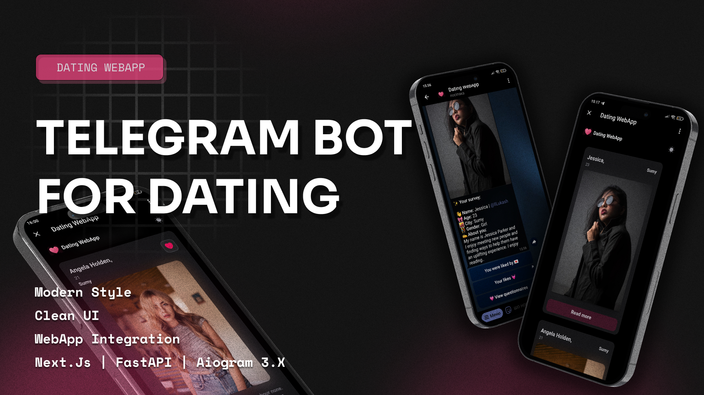

# Dating Telegram Bot WebApp  





This project is Dating Telegram Bot WebApp, which combines the capabilities of a dating Telegram bot with a WebApp for
easy use.

## Description of the project

Dating Telegram Bot WebApp allows users to meet through the Telegram bot, as well as use a convenient web interface to
view profiles, send messages and manage interactions with other users.

## Installation and launch

Python, FastAPI, PostgresSQL, Tortoise ORM, Typescript and Next.JS must be installed to run this project. After cloning
the repository, follow these steps:

1. Install the Python dependencies:
    ```
    pip install poetry
    ```
    ```
    poetry install
    ```
    ```
    poetry shell
    ```
2. Install Typescript and Next.JS dependencies:
    ```
    npm install
    ```
3. Make changes to the [.env](/.env.example) file.
4. Start the FastAPI server:
    ```
    uvicorn backend.main:app --reload
    ```
5. Start the Next.JS web client (before that, go to the deritory: frontend):
    ```
    npm run dev
    ```
6. Use [Ngrok](https://ngrok.com/) or [localtunnel](https://theboroer.github.io/localtunnel-www/) to open the https
   tunnels of our apps.
    - In the file [start_tunnels.bat](start_tunnels.bat), an example with localtunnel is shown.
7. Start the Telegram bot:
    ```
    python bot/main.py
    ```

After these steps, your Dating Telegram Bot WebApp will be available.

## Contribute

If you would like to contribute to this project, please open a new Pull Request or Issue on GitHub.

## Licence

This project is distributed under the MIT license. See the LICENSE file for details.
